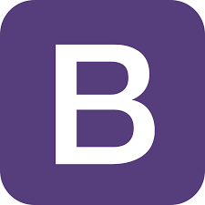

<h1>My Personal Web Page</h1> 

-----------------

:speech_balloon: [Acerca del proyecto](#id1)    

:video_game: [Sobre el desafío](#id2)

:clipboard: [Características del proyecto](#id3)

:eye_speech_bubble: [Visita la página](#id4)

--------------

--------------------------

### Acerca del proyecto 

Realización de una web personal como proyecto para el bootcamp de Full Stack Developer de [GeeksHubs Academy](https://bootcamp.geekshubsacademy.com/).

### Sobre el desafío

Para mí fue todo un desafío poder lograr que sea responsive. He utlizado tanto Bootstrap, medias querys y flex.

### Características del proyecto

Para la realización de este trabajo contamos con las siguientes herramientas y tecnologías.

|  | Visual Code Estudio |

|  | HTML5 |

|  | CSS3 | 

|  | Git |

|  | GitHub | 

|  | Bootstrap | 

|  | JavaScript | 

 

### Visita la página del proyecto en GitHub

[My Personal Web Page](https://mlfernandez.github.io/MyWeb/index.html)

 
 

[Subir](#top)